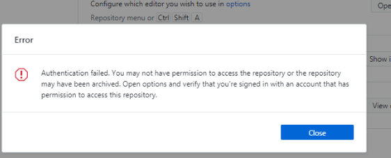

Issue with latest commits to github :
Certain files are missing in commits in FYP AWS_Iot_NodeJS_Website_FYP and Main1 
Missing .ino files and certain .js files 

After pushing my recents commits on my PC it pushed and then displays an Error message as captured below 

going to try push files on another computer 
